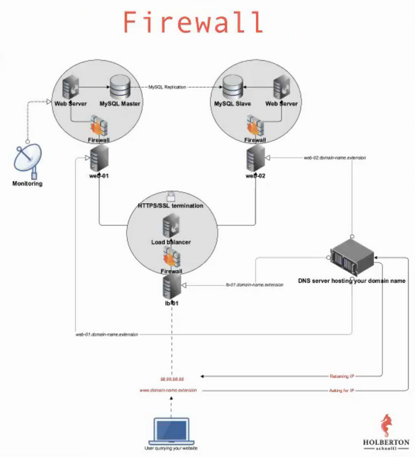

<h1 align ="center">0x0C. Web server</h1><br>
<p align="center">
  
</p>

## DNS:books:
DNS is, in simple words, the technology that translates human-adapted, text-based domain names to machine-adapted, numerical-based IP:

[Learn everything about DNS in cartoon](https://howdns.works/)
Be sure to know the main DNS record types:
* [A](https://support.dnsimple.com/articles/a-record/)
* [CNAME](https://en.wikipedia.org/wiki/CNAME_record)
* [MX](https://en.wikipedia.org/wiki/MX_record)
* [TXT](https://en.wikipedia.org/wiki/TXT_record)

Advanced
*    [Use DNS to scale with round-robin DNS](https://www.dnsknowledge.com/whatis/round-robin-dns/)
* [What’s an NS Record?](https://support.dnsimple.com/articles/ns-record/)
* [What’s an SOA Record?](https://support.dnsimple.com/articles/soa-record/)

The root domain and sub domain - differences

A root domain is the parent domain to a sub domain, and its name is not, and can not be divided by a dot.

While creating any domain at a website of domain provider, the provider system will always ask you to choose a domain name without a dot in the name. In other words, the address of the root domain may be mydomain.com but it can never be my.domain.com. Domain providers block the ability to create such a root domain until you type a name without the dot. Why?

The dot in the domain name delimits the sub domain name (the part of the name before the dot, eg. www.my.) and the root domain name ( the part after the dot, ie .domain.com). This means that the address my.domain.com is a sub domain of the root domain, whose name is domain.com

In an administrator panel at domain provider account, you can create any number of sub domains. This means that for the root domain called domain.com it is possible to create different sub domains eg. my.domain.com, your.domain.com, holberton.domain.com… Creating multiple sub domains is always free and does not require you to set up new accounts on a domain provider website.

As you can see, all of the domain addresses used as an example (above) do not start with the www prefix. www is also a sub domain. The www prefix always leads to the main domain. See: What’s the point in having www in a url?

---
## Web Server
Do not mix up web server and server.

A web server is a software that delivers web pages. A server is an actual computer.

But you might hear people referring to a web server using the word server. 
As mentioned above, a server is a physical machine, an actual computer, but in the Cloud era that could also be a virtual computer, generally called a VM (Virtual Machine) or container.

Readme:
* [Wikipedia page about web server](https://en.wikipedia.org/wiki/Web_server)
* [Web server](https://en.wikipedia.org/wiki/Web_server)
* [What is a Web Server?](https://developer.mozilla.org/en-US/docs/Learn/Common_questions/What_is_a_web_server)

---
## CI/CD
The lean/agile methodology (See: [Twelve Principles of Agile Software](http://agilemanifesto.org/principles.html)) is now widely used by the industry and one of its key principles is to iterate as fast as possible. If you apply this to software engineering, it means that you should:
*   code
*   ship your code
*   measure the impact
*   learn from it
*   fix or improve it
*   start over

As fast as possible and with small iterations in days or even hours (whereas it used to be weeks or even months). One big advantage is that if product development is going the wrong direction, fast iteration will allow to quickly detect this, and avoid wasting time.

From a technical point of view, quicker iterations mean fewer lines of code being pushed at every deploy, which allows easy performance impact measurement and easy troubleshooting if something goes wrong (better to debug a small code change than weeks of new code).

Applied to software engineering, CI/CD (Continuous Integration/Continuous Deployment) is a principle that allows individuals or teams to have a lean/agile way of working.

This translates to a “shipping pipeline” which is often built with multiple tools such as:
*   Shipping the code:
*    Capistrano, Fabric
*   Encapsulating the code
*    Docker, Packer
*   Testing the code
*    Jenkins, CircleCi, Travis
*   Measuring the code
*    Datadog, Newrelic, Wavefront

---
## Docker
*    [What is Docker and why is it popular?](https://www.zdnet.com/article/what-is-docker-and-why-is-it-so-darn-popular/)

Let’s first pull a Docker image and run a container:
```
vagrant@ubuntu-xenial:~$ docker ps
CONTAINER ID        IMAGE               COMMAND             CREATED             STATUS              PORTS               NAMES
vagrant@ubuntu-xenial:~$ docker run -d -ti ubuntu:16.04
Unable to find image 'ubuntu:16.04' locally
16.04: Pulling from library/ubuntu
34667c7e4631: Pull complete
d18d76a881a4: Pull complete
119c7358fbfc: Pull complete
2aaf13f3eff0: Pull complete
Digest: sha256:58d0da8bc2f434983c6ca4713b08be00ff5586eb5cdff47bcde4b2e88fd40f88
Status: Downloaded newer image for ubuntu:16.04
e1fc0d4bbb5d3513b8f7666c91932812da7640346f6e05b7cfc3130ddbbb8278
vagrant@ubuntu-xenial:~$ docker ps
CONTAINER ID        IMAGE               COMMAND             CREATED              STATUS              PORTS               NAMES
e1fc0d4bbb5d        ubuntu:16.04        "/bin/bash"         About a minute ago   Up About a minute                       keen_blackwell
vagrant@ubuntu-xenial:~$
```
Note that docker command will pull the Ubuntu docker container image from the Internet and run it. I let you look at the meaning of the flags using the command docker run --help, the main idea is that it keeps the container up and running.

To execute a command on the Docker container, use docker exec:
```
vagrant@ubuntu-xenial:~$ docker exec -i e1fc0d4bbb5d hostname
e1fc0d4bbb5d
vagrant@ubuntu-xenial:~$ hostname
ubuntu-xenial
vagrant@ubuntu-xenial:~$
```
If you want to connect to your Docker container and use Bash, you need to use docker exec -ti:
```
vagrant@ubuntu-xenial:~$ docker exec -ti e1fc0d4bbb5d /bin/bash
root@e1fc0d4bbb5d:/# echo "I am in $(hostname) Docker container"
I am in e1fc0d4bbb5d Docker container
root@e1fc0d4bbb5d:/# exit
exit
vagrant@ubuntu-xenial:~$
```
If you want to stop a container, use docker stop:
```
vagrant@ubuntu-xenial:~$ docker ps
CONTAINER ID        IMAGE               COMMAND             CREATED             STATUS              PORTS               NAMES
e1fc0d4bbb5d        ubuntu:16.04        "/bin/bash"         5 minutes ago       Up 5 minutes                            keen_blackwell
vagrant@ubuntu-xenial:~$ docker stop e1fc0d4bbb5d
e1fc0d4bbb5d
vagrant@ubuntu-xenial:~$ docker ps
CONTAINER ID        IMAGE               COMMAND             CREATED             STATUS              PORTS               NAMES
vagrant@ubuntu-xenial:~$
```

---
## Web stack debugging
Debugging usually takes a big chunk of a software engineer’s time. The art of debugging is tough and it takes years, even decades to master, and that is why seasoned software engineers are the best at it… experience. They have seen lots of broken code, buggy systems, weird edge cases and race conditions.

### Non-exhaustive guide to debugging
If you are struggling to get something right that is run on the checker, like a Bash script or a piece of code, keep in mind that you can simulate the flow by starting a Docker container with the distribution that is specified in the requirements and by running your code. Check the Docker concept page for more info.
Test and verify your assumptions

The idea is to ask a set of questions until you find the issue. For example, if you installed a web server and it isn’t serving a page when browsing the IP, here are some questions you can ask yourself to start debugging:

* Is the web server started? - You can check using the service manager, also double check by checking process list.
* On what port should it listen? - Check your web server configuration
* Is it actually listening on this port? - netstat -lpdn - run as root or sudo so that you can see the process for each listening port
* It is listening on the correct server IP? - netstat is also your friend here
* Is there a firewall enabled?
* Have you looked at logs? - usually in /var/log and tail -f is your friend
* Can I connect to the HTTP port from the location I am browsing from? - curl is your friend

There is a good chance that at this point you will already have found part of the issue.
Get a quick overview of the machine state

When you connect to a server/machine/computer/container you want to understand what’s happened recently and what’s happening now, and you can do this with 5 commands in a minute or less:

### w
* shows server uptime which is the time during which the server has been continuously running
* shows which users are connected to the server
* load average will give you a good sense of the server health - (read more about load here and here)

### history
* shows which commands were previously run by the user you are currently connected to
* you can learn a lot about what type of work was previously performed on the machine, and what could have gone wrong with it
* where you might want to start your debugging work

### top
* shows what is currently running on this server
* order results by CPU, memory utilization and catch the ones that are resource intensive

### df
* shows disk utilization

### netstat
* what port and IP your server is listening on
* what processes are using sockets
* try netstat -lpn on a Ubuntu machine

### Machine
Debugging is pretty much about verifying assumptions, in a perfect world the software or system we are working on would be working perfectly, the server is in perfect shape and everybody is happy. But actually, it NEVER goes this way, things ALWAYS fail (it’s tremendous!).

For the machine level, you want to ask yourself these questions:
* Does the server have free disk space? - df
* Is the server able to keep up with CPU load? - w, top, ps
* Does the server have available memory? free
* Are the server disk(s) able to keep up with read/write IO? - htop

If the answer is no for any of these questions, then that might be the reason why things are not going as expected. There are often 3 ways of solving the issue:
* free up resources (stop process(es) or reduce their resource consumption)
* increase the machine resources (adding memory, CPU, disk space…)
* distributing the resource usage to other machines

### Network issue
For the machine level, you want to ask yourself these questions:
* Does the server have the expected network interfaces and IPs up and running? ifconfig
* Does the server listen on the sockets that it is supposed to? netstat (netstat -lpd or netstat -lpn)
* Can you connect from the location you want to connect from, to the socket you want to connect to? telnet to the IP + PORT (telnet 8.8.8.8 80)
* Does the server have the correct firewall rules? iptables, ufw:
*   iptables -L
*   sudo ufw status

### Process issue
If a piece of Software isn’t behaving as expected, it can obviously be because of above reasons… but the good news is that there is more to look into (there is ALWAYS more to look into actually).
* Is the software started? init, init.d:
*  service NAME_OF_THE_SERVICE status
*  /etc/init.d/NAME_OF_THE_SERVICE status
* Is the software process running? pgrep, ps:
*  pgrep -lf NAME_OF_THE_PROCESS
*  ps auxf
* Is there anything interesting in the logs? look for log files in /var/log/ and tail -f is your friend

### Debugging is fun
Debugging can be frustrating, but it will definitely be part of your job, it requires experience and methodology to become good at it. The good news is that bugs are never going away, and the more experienced you become, trickier bugs will be assigned to you! Good luck :)

---
## DevOps
DevOps is not a specific position, nor is it a set of tools. It is rather a movement/culture centered around the marriage of development and operations teams, which have traditionally been siloed within a company. It is an outgrowth of the [Agile methodology](https://en.wikipedia.org/wiki/Agile_software_development) which emphasizes rapid software development through small but continuous changes to a company’s codebase, rather than large and infrequent overhauls. DevOps seeks to encourage collaboration between the software developers who write the code, and operations (systems engineers, system administrators, release engineers, database administrators, network engineers, security professionals, etc.) who put the code into production.

Several separate concepts/services have been developed out of the DevOps movement such as:

### Build Automation
* Build automation is the process of using tools to automatically build code from source in order to prepare it for deployment to a live environment. This includes compiling, linting, minifying, transforming, and unit testing.
* Some of the benefits are that it makes building fast, consistent, repeatable, portable, and reliable.

### Continuous Integration
* The process of continuously pushing code and integrating with the code base.
* It is done with the help of a CI server which executes automated builds/tests.
* If there is a problem, developers are notified so that they may act upon bugs immediately.
* It eliminates the scramble to release that is a frequent issue with monolithic architectures, makes frequent releases possible, and makes continuous testing possible.

### Continuous Delivery
* Continuous delivery is about always maintaining code in a state which could be pushed into production.
* This allows changes to be rolled back much more easily.
* The benefits include a faster time to market, fewer issues with deployment, and lower risk.

### Continuous Deployment
* Continuous deployment consists of frequently making small changes to code which are pushed to production continuously.
* This differs from continuous delivery in that it is about actually pushing the code into production, rather than maintaining it in a state which is ready for deployment.

### Infrastructure as Code (IAC)
* IAC is about managing and provisioning infrastructure through code and automation.
* Infrastructure consists of servers, instances, environments, containers, clusters, etc.
* IAC allows for consistency, reusability, and scalability.

### Configuration Management
* CM is the process of maintaining and changing the state of infrastructure in a consistent and stable way.
* eg. upgrade a software package on a bunch of servers automatically rather than manually.
* CM saves time, provides insight into current state of infrastructure, and is maintainable because the infrastructure is stable.

### Orchestration
* Orchestration is a type of automation that supports processes and workflows, such as the provisioning of resources.
* eg. a system is experiencing increased load, a customer or monitoring tool recognizes an increased need for resources, and automatically puts together additional resources.
* It is scalable, stable, time-saving, and self-servicing.

### Monitoring
* It is the collection and presentation of data about the performance and stability of services and infrastructure.
* It collects information and statistics on memory use, cpu, disk i/o, application logs, network traffic.
* Provides real-time notifications; postmortem analysis.
* Allows for fast recovery, better root cause analysis, visibility across teams (both dev and ops), and automated responses.

### Microservices
* A particular software architecture which breaks an application up into a collection of small, loosely-coupled services.
* The services work together via APIs
* Microservices are modular which reduces complexity in maintenance, technological flexibility (you can use different tools, languages, etc.), and provide optimized scalability,

As mentioned above, DevOps is not a set of tools, however, in order to make the idea a reality, several tools have been developed.

Example DevOps Tools:
* Build Automation
*   Java - ant, maven, gradle
*   Javascript - npm, grant, gulp
*   Unix-based - Make
*   Machine images and containers - Packer
* Continuous Integration
*   Bamboo
*   Gitlab
*   Jenkins
*   Travis CI
* Configuration Management
*   Puppet
*   Chef
*   Ansible
*   Salt
* Virtualization and Containerization
*   Vagrant
*   Docker
* Monitoring
*   SenSu
*   SumoLogic
*   NewRelic
*   AppDynamics
*   DataDog
* Orchestration
*   Docker Swarm
*   Kubernetes
*   Zookeeper
*   Terraform

For a more full listing of DevOps tools, see the [Periodic Table of DevOps Tools](https://digital.ai/periodic-table-of-devops-tools)

Check out:
* [What is DevOps?](https://theagileadmin.com/what-is-devops/)
* [Understanding Agile Methodology](https://digital.ai/resources/agile-101)

---
## System Administration
A system administrator is the person in the IT department in charge of purchasing, maintaining, upgrading and testing the (multi-user) computer systems of a company. They are tasked with ensuring that all systems are up to date (both in terms of software and hardware), secure, and operational. The sysadmin is the usually the person with root privileges who assigns user and group permissions to all other users. This role often involves being on-call in the case of server malfunction or meltdown. Sysadmins do not necessarily need a strong background in programming, but are typically very comfortable with the Linux OS, as most servers run on Linux, and Bash, as it is the primary mode of interacting with and automating server-side tasks. Today’s system administrators are also typically familiar more modern automation tools such as Puppet, Chef, and Ansible, which make configuring servers much more scalable.

Check out:
* [What is the Role of a System Administrator?(https://www.cyberciti.biz/faq/what-is-the-role-of-the-system-administrator/)
* [System Administration](https://en.wikiversity.org/wiki/System_administration)

---
## Site Reliability Engineering
Site reliability engineering is the application of DevOps principles to a specific role within an IT company. There is a growing market for SREs as they help ensure that the process of iterating code is continuous, scalable, and reliable. They bridge the gap between development and operations as not only must they excel at the tasks previously relegated to system engineers/administrators, but they must also have a solid background in programming. The role will look different in different companies, depending on their size and infrastructure, but an SRE will typically spend part of their time maintaining systems, and the rest of their time building features or internal tools, scaling, and automating.

Checkout:
* [What is ‘Site Reliability Engineering’?](https://landing.google.com/sre/interview/ben-treynor-sloss/)
* [Love DevOps? Wait Until you meet SRE](https://www.atlassian.com/incident-management/devops/sre)
* [Site Reliability Engineering](https://en.wikipedia.org/wiki/Site_Reliability_Engineering)

---
## Background Context

In this project, some of the tasks will be graded on 2 aspects:
* Is your web-01 server configured according to requirements
* Does your answer file contain a Bash script that automatically performs commands to configure an Ubuntu machine to fit requirements (meaning without any human intervention)

For example, if I need to create a file /tmp/test containing the string hello world and modify the configuration of Nginx to listen on port 8080 instead of 80, I can use emacs on my server to create the file and to modify the Nginx configuration file /etc/nginx/sites-enabled/default.

But my answer file would contain:
```
sylvain@ubuntu cat 88-script_example
#!/usr/bin/env bash
# Configuring a server with specification XYZ
echo hello world > /tmp/test
sed -i 's/80/8080/g' /etc/nginx/sites-enabled/default
sylvain@ubuntu
```
As you can tell, I am not using emacs to perform the task in my answer file. This exercise is aiming at training you on automating your work. If you can automate tasks that you do manually, you can then automate yourself out of repetitive tasks and focus your energy on something more interesting. For an SRE, that comes very handy when there are hundreds or thousands of servers to manage, the work cannot be only done manually. Note that the checker will execute your script as the root user, you do not need to use the sudo command.

A good Software Engineer is a lazy Software Engineer.

Tips: to test your answer Bash script, feel free to reproduce the checker environment:
* start an ubuntu:16.04 Docker container
* run your script on it
* see how it behaves

Check out the Docker concept page for more info about how to manipulate containers.

---
## Resources:books:
Read or watch:
* [How the web works](https://intranet.hbtn.io/rltoken/4tRRzyyETAySzU-bgNGLSw)
* [Nginx](https://intranet.hbtn.io/rltoken/H9OfhUnBDdxV-QQnIucMlA)
* [How to Configure Nginx](https://intranet.hbtn.io/rltoken/wePwmjbJDgJZO7YPvffWxQ)
* [Child process](https://intranet.hbtn.io/rltoken/V8RZRTiBQBweSGFenuQX5w)
* [Root and sub domain](https://intranet.hbtn.io/rltoken/qkpso3mgcpv3tPUhBrZBOA)
* [HTTP requests](https://intranet.hbtn.io/rltoken/C9s3U62JbiOAvn9WCoxKsA)
* [HTTP redirection](https://intranet.hbtn.io/rltoken/kI4vRQ6vc45Wfbdo3UD8Lw)
* [Not found HTTP response code](https://intranet.hbtn.io/rltoken/5UvC588x2hZR7dm6eRFPoQ)
* [Logs files on Linux](https://intranet.hbtn.io/rltoken/bkqQ72HZVAV65G8nB503Pw)

### For reference:
* [RFC 7231 (HTTP/1.1)](https://tools.ietf.org/html/rfc7231)
* [RFC 7540 (HTTP/2)](https://tools.ietf.org/html/rfc7540)

### man or help:
* scp
* curl

---
## Learning Objectives:bulb:
What you should learn from this project:

* What is the main role of a web server
* What is a child process
* Why web servers usually have a parent process and child processes
* What are the main HTTP requests

---

### [0. Transfer a file to your server](./0-transfer_file)
* Write a Bash script that transfers a file from our client to a server:

Requirements:
* Accepts 4 parameters
*   The path to the file to be transferred
*   The IP of the server we want to transfer the file to
*   The username scp connects with
*   The path to the SSH private key that scp uses
*Display Usage: 0-transfer_file PATH_TO_FILE IP USERNAME PATH_TO_SSH_KEY if less than 3 parameters passed
* scp must transfer the file to the user home directory ~/
* Strict host key checking must be disabled when using scp

Example:
```
sylvain@ubuntu$ ./0-transfer_file
Usage: 0-transfer_file PATH_TO_FILE IP USERNAME PATH_TO_SSH_KEY
sylvain@ubuntu$
sylvain@ubuntu$ ssh ubuntu@34.75.91.155 -i ~/.ssh/holberton 'ls ~/'
sylvain@ubuntu$ 
sylvain@ubuntu$ touch some_page.html
sylvain@ubuntu$  ./0-transfer_file some_page.html 34.75.91.155 ubuntu ~/.ssh/holberton
some_page.html                                  100%    0     0.0KB/s   00:00
sylvain@ubuntu$ ssh ubuntu@34.75.91.155 -i ~/.ssh/holberton 'ls ~/'
afile
some_page.html
sylvain@ubuntu$
```
In this example, I:
* remotely execute the ls ~/ command via ssh to see what ~/ contains
* create a file named some_page.html
* execute my 0-transfer_file script
* remotely execute the ls ~/ command via ssh to see that the file some_page.html has been successfully transferred

That is one way of publishing your website pages to your server.

### [1. Install nginx web server](./1-install_nginx_web_server)
Readme:
* [-y on apt-get command](https://askubuntu.com/questions/672892/what-does-y-mean-in-apt-get-y-install-command)

Web servers are the piece of software generating and serving HTML pages, let’s install one!

Requirements:
* Install nginx on your web-01 server
* Nginx should be listening on port 80
* When querying Nginx at its root / with a GET request (requesting a page) using curl, it must return a page that contains the string Holberton School
* As an answer file, write a Bash script that configures a new Ubuntu machine to respect above requirements

Example:
```
sylvain@ubuntu$ curl 34.198.248.145/
Holberton School for the win!
sylvain@ubuntu$ curl -sI 34.198.248.145/
HTTP/1.1 200 OK
Server: nginx/1.4.6 (Ubuntu)
Date: Tue, 21 Feb 2017 23:43:22 GMT
Content-Type: text/html
Content-Length: 30
Last-Modified: Tue, 21 Feb 2017 07:21:32 GMT
Connection: keep-alive
ETag: "58abea7c-1e"
Accept-Ranges: bytes

sylvain@ubuntu$
```
In this example 34.198.248.145 is the IP of my web-01 server. If you want to query the Nginx that is locally installed on your server, you can use curl 127.0.0.1.

If things are not going as expected, make sure to check out Nginx logs, they can be found in /var/log/.


### [2. Setup a domain name](./2-setup_a_domain_name)
* [.TECH Domains](https://get.tech/) is one of the top domain providers. They are known for the stability and quality of their DNS hosting solution. Holberton School partnered with .TECH Domains so that you can learn about DNS.

.TECH Domains worked with domain name registrars to give you access to a free domain name for a year. Please get the promo code in your tools space. Feel free to drop a thank you tweet for .TECH Domains.

Provide the domain name in your answer file.

Requirement:
* provide the domain name only (example: foobar.tech), no subdomain (example: www.foobar.tech)
* configure your DNS records with an A entry so that your root domain points to your web-01 IP address Warning: the propagation of your records can take time (~1-2 hours)
* go to your profile and enter your domain in the Project website url field

Example:
```
sylvain@ubuntu$ cat 2-setup_a_domain_name
holbertonschool.tech
sylvain@ubuntu$
sylvain@ubuntu$ dig holbertonschool.tech

; <<>> DiG 9.10.6 <<>> holbertonschool.tech
;; global options: +cmd
;; Got answer:
;; ->>HEADER<<- opcode: QUERY, status: NOERROR, id: 26785
;; flags: qr rd ra; QUERY: 1, ANSWER: 1, AUTHORITY: 0, ADDITIONAL: 1

;; OPT PSEUDOSECTION:
; EDNS: version: 0, flags:; udp: 512
;; QUESTION SECTION:
;holbertonschool.tech.      IN  A

;; ANSWER SECTION:
holbertonschool.tech.   7199    IN  A   184.72.193.201

;; Query time: 65 msec
;; SERVER: 8.8.8.8#53(8.8.8.8)
;; WHEN: Fri Aug 02 09:44:36 PDT 2019
;; MSG SIZE  rcvd: 65

sylvain@ubuntu$
```
When your domain name is setup, please verify the Registrar here: https://whois.whoisxmlapi.com/ and you must see in the JSON response: "registrarName": "Dotserve Inc"

### [3. Redirection](./3-redirection)
Readme:
* [Replace a line with multiple lines with sed](https://stackoverflow.com/questions/26041088/sed-replace-line-with-multiline-variable)

Configure your Nginx server so that /redirect_me is redirecting to another page.

Requirements:
* The redirection must be a “301 Moved Permanently”
* You answer file should be a Bash script containing commands to automatically configure a Ubuntu machine to respect above requirements
* Using what you did with 1-install_nginx_web_server, write 3-redirection so that it configures a brand new Ubuntu machine to the requirements asked in this task

Example:
```
sylvain@ubuntu$ curl -sI 34.198.248.145/redirect_me/
HTTP/1.1 301 Moved Permanently
Server: nginx/1.4.6 (Ubuntu)
Date: Tue, 21 Feb 2017 21:36:04 GMT
Content-Type: text/html
Content-Length: 193
Connection: keep-alive
Location: https://www.youtube.com/watch?v=QH2-TGUlwu4

sylvain@ubuntu$
```

### [4. Not found page 404](./4-not_found_page_404)
* Configure your Nginx server to have a custom 404 page that contains the string Ceci n'est pas une page.

Requirements:
* The page must return an HTTP 404 error code
* The page must contain the string Ceci n'est pas une page
* Using what you did with 3-redirection, write 4-not_found_page_404 so that it configures a brand new Ubuntu machine to the requirements asked in this task

Example:
```
sylvain@ubuntu$ curl -sI 34.198.248.145/xyz
HTTP/1.1 404 Not Found
Server: nginx/1.4.6 (Ubuntu)
Date: Tue, 21 Feb 2017 21:46:43 GMT
Content-Type: text/html
Content-Length: 26
Connection: keep-alive
ETag: "58acb50e-1a"

sylvain@ubuntu$ curl 34.198.248.145/xyzfoo
Ceci n'est pas une page

sylvain@ubuntu$
```

### [5. Design a beautiful 404 page](./5-design_a_beautiful_404_page)
Some of my favorites:
* [Digital Ocean](https://www.digitalocean.com/community/tutorials/holbertonschool)
* [Github](https://github.com/holbertonschool/pagenotfound)
* [Lego](https://www.lego.com/en-us/404)
* [Blizzard](https://www.blizzard.com/en-us/404)
* [StickerMule](https://www.stickermule.com/404)

Get creative and impress us!

Note that if you decide to have your creative 404 page as the default one, make sure that it still contains the string Ceci n'est pas une page (otherwise the checker will fail your previous project).

Submit the URL of your 404 page in the field bellow.

Please, remember that these blogs must be written in English to further your technical ability in a variety of settings.

It is your responsibility to request a review for this task from a peer before the project’s deadline. If no peers have been reviewed, you should request a review from a TA or staff member.

### [6. Install Nginx web server (w/ Puppet)](./7-puppet_install_nginx_web_server.pp)
* Time to practice configuring your server with Puppet! Just as you did before, we’d like you to install and configure an Nginx server using Puppet instead of Bash. To save time and effort, you should also include resources in your manifest to perform a 301 redirect when querying /redirect_me.

Requirements:
* Nginx should be listening on port 80
* When querying Nginx at its root / with a GET request (requesting a page) using curl, it must return a page that contains the string Holberton School
* The redirection must be a “301 Moved Permanently”
* Your answer file should be a Puppet manifest containing commands to automatically configure an Ubuntu machine to respect above requirements

---

## Author
* **Robinson Montes** - [mecomonteshbtn](https://github.com/mecomonteshbtn)